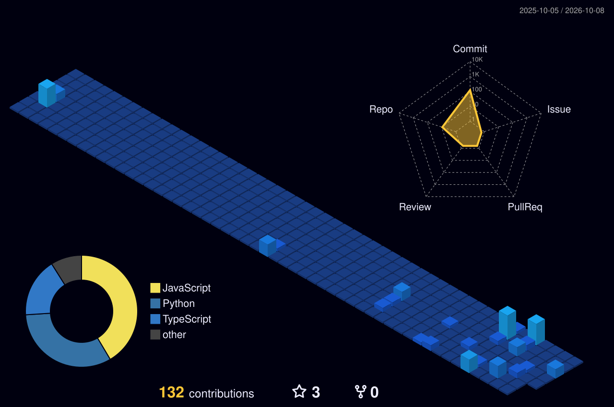

## Projects

| Project | What it is | Stack | Links |
| --- | --- | --- | --- |
| **AI-Video-Summarizer** | Timestamped transcripts, auto chapters and a RAG Q&A assistant that cites timestamps. Runs fully offline on CPU. | Python · Whisper · YOLOv8 · CLIP · BART · FAISS | [Code](https://github.com/JAIVARDHAN1402/AI-Video-Summarizer) |
| **COPS** | Caterpillar Operator Protection System for off-highway machines with AI integrations. | AI · Web | [Live](https://cops-caterpillar-operator-protectio.vercel.app) |
| **JaiOS Portfolio** | Portfolio that boots like Windows on desktop and Android on mobile. | JavaScript | [Live](https://jai-portfolio-chi.vercel.app) · [Code](https://github.com/JAIVARDHAN1402/JaiPortfolio) |
| **Placement Tracker** | Apply, track and analyse your company applications. | JavaScript | [Live](https://placement-tracker-azure.vercel.app) · [Code](https://github.com/JAIVARDHAN1402/Placement_Tracker) |
| **InterviewAI** | Mock interviews for various job roles. | JavaScript | [Live](https://interviewai-five-brown.vercel.app) · [Code](https://github.com/JAIVARDHAN1402/InterviewAI) |
| **Bookify** | Ticket booking system. | JavaScript | [Live](https://bookify-ticket.vercel.app) · [Code](https://github.com/JAIVARDHAN1402/Bookify) |
| **ProjectX** | Where builders share projects and spark the next idea. | TypeScript | [Live](https://project-x-seven-drab.vercel.app) · [Code](https://github.com/JAIVARDHAN1402/ProjectX---Get-Ideas-From-Experience) |

## Contribution city

<picture>
  <source media="(prefers-color-scheme: dark)" srcset="profile-3d-contrib/profile-night-view.svg"/>
  
</picture>

